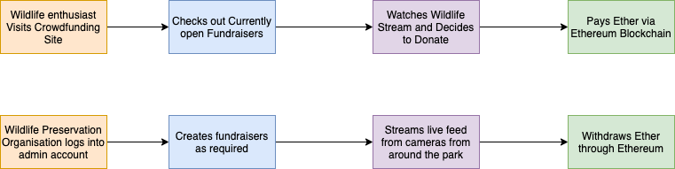
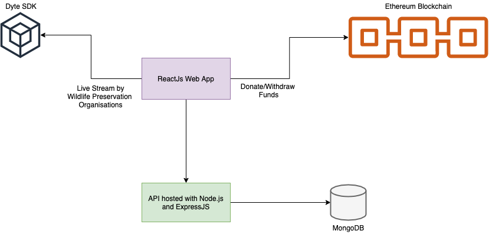

# Wild Sprint

*This project won first place in the tracks of industrial collaborations with Ethereum and Dyte in the DevSpace '21 Hackathon by The Computer Society of India - VIT*

## What is it?

A user-friendly web application for wildlife preservation organisations to obtain funds in a secure, safe and easily trackable manner. By integrating Dyte SDK into the platform, the fundraising organisations can directly live-stream videos from the preservation site via a special account. Ethereum smart contracts facilitate donations to the organisations by any regular user who could look at the livestreams before opting to donate.

## Why this Application?

Crowdfunding as it is right now could use more transparency. In this project, we attempt to make crowdfunding for wildlife preservation more secure, easily accessible and transparent.

We believe in this scenario, there is enough incentive on both sides. The wildlife enthusiasts get to watch the good they have done through their donations (given they cant travel directly because of the pandemic) and the national parks/wildlife sanctuaries receive a secure means for obtaining funds. 

Using Ethereum blockchain in this use case would make the donations safer, easier across borders and easily trackable. We’ll be using Dyte to live stream the videos directly from the national parks to the users who would like to donate.

For a video walk-through checkout our [youtube video](https://www.youtube.com/watch?v=izMW93BM-xs&t=2s)

## Flow

## Tech Stack

1. ReactJS
2. Node.js with Express (check [here](https://github.com/ambur-biryani/wild-sprint-backend))
3. Ethereum Solidity
4. MongoDB

## Overall Architecture

## Presentation

Check our final [presentation document](./assets/wildsprint_v3.pptx) to the [problem statement](assets/problem_statement.pdf) here.

##### Made with ❤  by team Ambur Biryani for DevSpace'21
